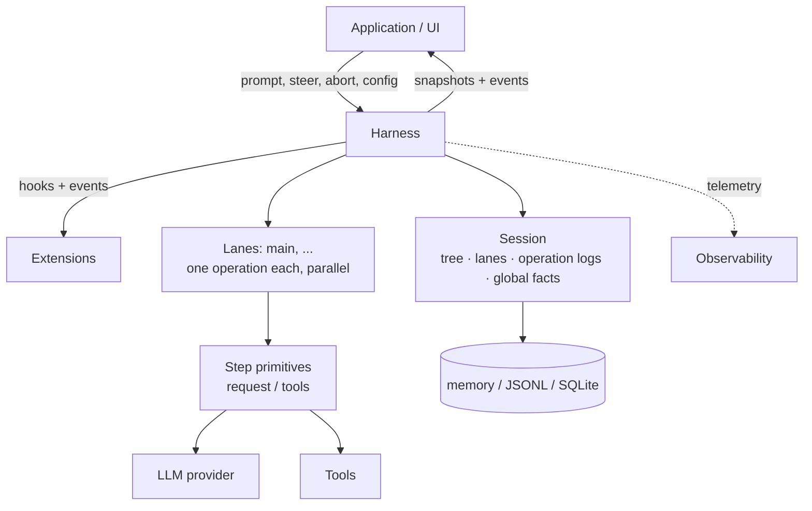
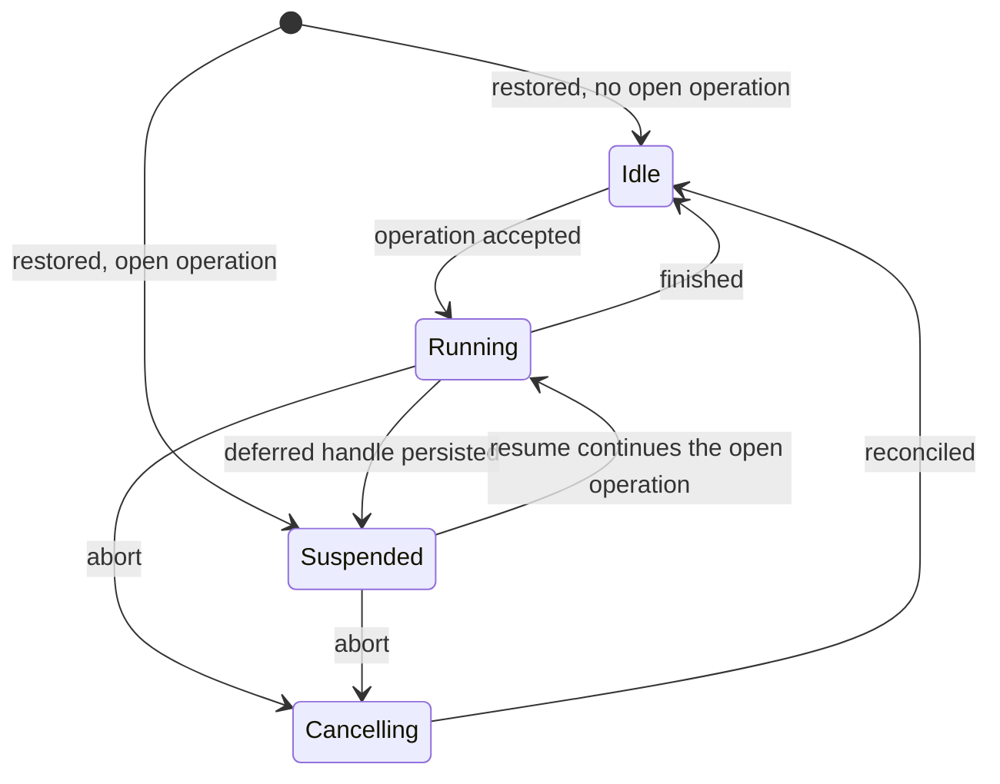
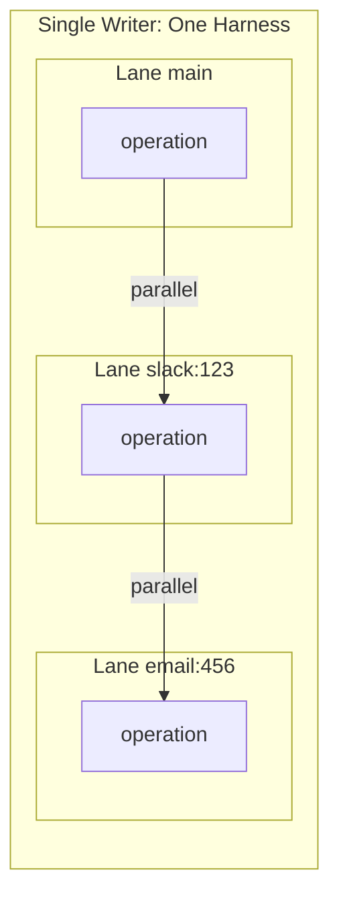

---

**【导读】** 在AI Agent框架遍地开花的今天，大多数框架将策略、模型调用、工具调用和状态变更混在一个循环中——这使得故障难以排查、回归难以证明。而PI项目给出的答案是：将Agent运行视为一个**可检查、确定性、可重放的状态机**。本文将深度解析PI项目AgentHarness v2的设计全貌。

---

## 一、项目介绍与背景

### 1.1 什么是PI项目

[PI项目](https://github.com/earendil-works/pi)（即 `earendil-works/pi`）是一个由独立开发者维护的全TypeScript/Monorepo架构的Agent运行时框架。截至目前已在GitHub获得约 **49,000+ ⭐**，采用MIT协议，代码极度活跃。

PI不是一个简单的Coding Agent终端工具，而是一套**分层清晰、职责分明的Agent运行时架构**。它的设计哲学强调：模块化、可扩展、可审查、可恢复。

### 1.2 为什么需要AgentHarness

现有的主流Agent框架（如LangChain、smolagents等）普遍采用单一循环结构：接收输入→调用LLM→执行工具→更新状态。这种设计的问题在于：

- **故障难以排查**：所有逻辑混在一起，出问题时难以定位是LLM调用、工具执行还是状态管理的锅
- **无法从中间状态恢复**：进程崩溃后，所有上下文丢失
- **难以测试**：无法精确控制执行步骤，无法模拟中间状态

AgentHarness v2的核心目标就是解决这三个问题——将Agent运行变成**可检查（inspectable）、确定性（deterministic）、可重放（replayable）**的状态机。

### 1.3 架构总览

先来看官方给出的核心架构图：



核心层级关系：

| 层级 | 名称 | 职责 |
|------|------|------|
| Layer 5 | UI | pi-tui (Terminal), pi-web-ui (Web) |
| Layer 4 | Application | pi-coding-agent (CLI Application) |
| Layer 3 | Agent Runtime | **pi-agent-core** — Agent Loop + Harness + Session |
| Layer 2 | LLM Interface | pi-ai — Multi-Provider Unified API |
| Layer 1 | Foundation | File System / Node.js |

---

## 二、核心概念翻译与解析

### 2.1 Session——四维持久化状态容器

Session（会话）是AgentHarness的核心持久化单元。它包含**四个独立又相互关联的部分**：

#### 第一维：Tree（对话树）

对话树是整个会话的"历史记录"，它是**共享的、被动的（passive）**数据结构。每个Entry通过`parentId`链接形成树形结构：

```text
tree (shared, append-only)
a ── b ── c ── d           (main lane)
      └── e ── f           (另一个分支)
```

Entry的类型包括：
- **message** — 对话消息
- **model_change** — 模型切换
- **thinking_level_change** — 思考层级变更
- **active_tools_change** — 工具激活变更
- **compaction** — 压缩摘要
- **branch_summary** — 分支摘要
- **custom** — 自定义条目

**关键约束**：树只能增长，从不修改或删除条目。分支共享前缀，但不复制任何内容。

#### 第二维：Lanes（通道）

Lane是"工作中的位置"。你可以理解为类比git的分支：每个lane有一个名称和一个叶子（leaf）位置，新工作接续在叶子之后，也可以跳转到树中的任意节点。

```text
tree (shared, append-only)          lanes
a ── b ── c ── d                    main            → d   (op log: …)
      └── e ── f                    slack:171943…   → f   (op log: …)

global facts: name = "Refactor auth", label(b) = "checkpoint-1"
```

每个Session都有默认的`main` lane，应用程序可以创建更多lane（以Slack thread id、email thread id等作为key）。

#### 第三维：Lane Operation Logs（操作日志）

这是**持久化的核心**——每个lane维护一条平坦的、按时序排列的记录序列：

```
operation_started → step_attempted → tool_started → message_queued → operation_finished
```

这些记录的存在意义：**让新进程能在崩溃后从最后一个安全边界继续工作**。正常执行过程中，没有任何东西会读取这些日志。

#### 第四维：Global Facts（全局事实）

会话级别的键值对，遵循"最新写入胜出"原则：会话名称、条目标签等。这些不是对话的一部分，而是以append-only历史形式保存。

**统一的序列号**：四个部分的写入共享一个单调递增的序列号（seq），用于排序全局事实历史，并让lane的操作日志能引用树中的位置。

### 2.2 Lanes——并行执行的安全边界

Lane是执行工作的线性序列。它与git分支的关键区别在于：**导航可以将lane移动到任意节点，而不只是向前**。

Lane的核心规则：

- **单写者保证**：一个harness同时只写入一个session。所有lanes共享那个写者，但各自的操作日志和叶子节点是隔离的
- **最多一个开放操作**：一个lane同时只能运行一个操作（Run/Compaction/Navigation）
- **并行不互扰**：Lanes并行执行，但lane记录和树条目在共享序列中交错存储

Lane的状态机：



### 2.3 Operations——可持久化的最小工作单元

Operation是lane上的**可持久化工作单元**，有三种类型：

| 类型 | 说明 |
|------|------|
| **Run** | 接收一个prompt，经过所有自动 continuations（工具调用、steering、follow-ups、自动压缩），直到没有待处理事项 |
| **Compaction** | 用摘要条目替换旧上下文 |
| **Navigation** | 将lane的叶子移动到现有条目，可选带分支摘要 |

**关键保证**：操作在执行前被接受（accepted），接受是持久化的。崩溃后，被接受的操作要么被恢复完成，要么被显式关闭。**不会有"半完成"的状态被观察到**。

### 2.4 Steps与Records——执行记录的精妙设计

#### Steps（步骤）

Step是操作内**可重试的工作单元**：

- 产生一条assistant消息、压缩摘要或分支摘要
- 一个step可能发出零个、一个或多个provider请求
- 失败的尝试会重试相同的step；**尝试计数是持久的，跨重启不丢失**

#### Records（记录）

Record是执行过程的"意图记录"，遵循**持久化规则**：

> **效果前**：写入一条intent记录，命名将要发生的事情及其将产生的id。
> **效果后**：以完全相同的id将结果作为entry追加。

```typescript
// Record的基础结构
interface RecordBase {
  id: string;
  seq: number;            // 共享序列号
  lane: string;
  timestamp: number;      // Unix ms
}

// 操作开始的记录
interface OperationStartedRecord extends RecordBase {
  type: "operation_started";
  sourceLeafId: string | null;
  intent: {
    kind: "run" | "compaction" | "navigation";
    // ... 根据kind有不同的payload
  };
}

// 步骤尝试记录
interface StepAttemptRecord extends RecordBase {
  type: "step_attempt";
  runId: string;
  step: "assistant" | "compaction" | "branch_summary";
  attempt: number;        // 1-based，持久化计数
  resultEntryId: string;  // 预分配的entry id
}

// 工具开始记录
interface ToolStartedRecord extends RecordBase {
  type: "tool_started";
  runId: string;
  assistantEntryId: string;
  toolIndex: number;
  toolCallId: string;
  toolName: string;
  effectiveArgs: Record<string, unknown>;
  resultEntryId: string;
  replay: "never" | "safe";  //  replay安全声明
}
```

**为什么Records和Tree Entries是分开的？**

因为Records描述的是执行过程，不是对话。它们**永远不应该进入模型上下文、transcripts、分支查询或fork**。在单个lane内，Records的顺序已经是它们的含义——parent链接不会增加任何东西。

---

## 三、设计哲学归纳

### 3.1 核心理念：Effects必须跨边界

AgentHarness v2的核心设计决策是：

> **每一种效果（effect）—— 持久化写入、provider请求、工具执行、hook调用、定时器 —— 都必须跨越一个注入的边界。**

这意味着在`drive: "manual"`模式下，harness在每个effect前停车，测试代码可以**逐个调用推进**：
- 在任意边界处停止
- 注入输入
- 关闭并重新打开以模拟崩溃

生产代码和测试代码运行**相同的程序**；drive模式只控制边界。

### 3.2 拒绝状态机方案的理由

文档中提到曾评估过一个"同步状态机"方案，但最终被拒绝。选择当前方案的理由：

1. **易于追踪和调试**：plain async/await匹配代码库其他部分，没有machine/executor的分裂需要跨边界推理
2. **类型自然**：无需在每个边界做yield-result联合类型转换
3. **复用现有组件**：复用agent-loop的构建块，而不是在状态机内部重新实现工具阶段
4. **零开销自动模式**：在自动模式下，stepping是生产代码的包装器，零开销；且能在并行工具调用之间停止

### 3.3 非目标（Non-goals）——知道什么不该做

设计文档明确列出了**不是目标的东西**，这是成熟设计的标志：

| 非目标 | 说明 |
|--------|------|
| **Exactly-once hook副作用** | Hook结果在消费它的record/entry提交时才变得持久 |
| **Provider流式恢复** | 部分流永远不持久；中断的流式请求会被重试或放弃 |
| **多写者** | 两个进程操作同一session超出范围 |
| **复制** | Session生活在一个地方；分歧副本的无协调同步是不同的设计 |

---

## 四、关键机制详解

### 4.1 持久化机制：Intent-Result配对

AgentHarness的持久化哲学可以用一句话概括：**"先写意图，再写结果"**。

```text
崩溃点分析表：

| 崩溃发生在 | 持久化状态 | 恢复动作 |
|---|---|---|
| step_attempt之后 | 未完成的assistant step | resume重试 |
| tool_started之后，无result | tool_started存在 | 根据replay策略决定 |
| tool_started之后，有result | result entry存在 | 跳过该工具 |
```

**关键不变量**：
- Intent被满足 **当且仅当** 具有其预分配id的entry存在
- 具有预分配id但内容不同的entry = 腐败（corruption）

### 4.2 恢复机制：Reduction算法

恢复（Resume）不是简单地从"上次位置"继续，而是通过**Reduction算法**从存储中重新计算状态：

```typescript
// 恢复时，从两条有界读取计算lane状态：
// 1. 该lane自 operation_started 以来的所有records
// 2. 该lane自 sourceLeafId 以来的所有entries

interface LaneReduction {
  aborting: boolean;                    // 是否正在中止
  attemptsUsed: number;                 // 已使用的尝试次数
  overflowRecoveryUsed: boolean;        // 是否已使用过overflow恢复
  toolBatch: ToolBatchState;            // 工具批次状态
  deferredHandle: DeferredHandle | null; // 延迟的provider请求句柄
  pendingQueueItems: QueueItem[];        // 待处理的队列项
  pendingWrites: ProvisionedEntry[];     // 待处理的写入
  missingInitialMessages: Entry[];       // 缺失的初始消息
}
```

**恢复的精确入口**：
- 缺失的初始消息 → 追加它们（接受的输入永不丢失）
- 正在中止 → 调和：合成工具结果、关闭assistant消息、`operation_finished` aborted
- 未解决的工具批次 → 按每条调用自己的位置处理
- 延迟句柄 → 兑现
- 终端失败（give-up entry） → 应用接受的写入，消耗排队的输入；如果没有新工作，追加`failed`
- 未完成的step → 恢复该step（如果重试计数允许则下一次尝试，否则失败操作）

### 4.3 并发控制：单写者 + Lane隔离



**单写者保证**：
- 服务层强制所有session流量路由到持有其harness的进程
- 恢复时将单写者无法产生的状态视为腐败

**Lane隔离保证**：
- 每个lane拥有自己的叶子、操作日志、队列和待处理写入
- 两个lane从不共享任何这些
- State-dependent mutations在一个lane上线性化：验证 → 最多一个持久化写入 → 内存更新完成，才能开始下一个mutation

### 4.4 队列与Deferred Writes

两个机制将输入带入运行中的lane，区别在于abort行为：

| 机制 | 用途 | abort行为 |
|------|------|----------|
| **Queues** | 承载对话意图：steer、followUp、nextRun | steer/followUp在abort时死亡；nextRun存活 |
| **Deferred Writes** | 承载事实：在step执行中请求的entries和配置变更 | 即使在取消期间也应用 |

**两者都在接受时持久化**：接受调用写入一条带完整payload的record到lane的操作日志，然后resolve。树entry稍后写入——当item被应用或消费时。

### 4.5 延迟Provider请求

这是v2设计的一个精妙特性：

```text
1. 请求发出，stream options设为"延迟执行"
2. Provider立即返回一个handle，携带该handle的assistant message被持久化
3. Lane暂停；prompt()返回outcome "suspended"
4. 稍后（可能不同进程）：resume()检测到悬停的延迟句柄
5. 兑现handle：获取真实结果，追加为后续assistant message
6. Run继续正常进行
```

关键保证：挂起的lane在存储中与崩溃的lane**无法区分**——都是一个开放操作，其最新entry是带未兑现句柄的延迟assistant message。

---

## 五、架构优势总结

### 5.1 与传统框架的对比

| 维度 | LangChain | smolagents | **AgentHarness v2** |
|------|-----------|------------|---------------------|
| 抽象层级 | Chain/LLM/Agent | 单Agent + Tool | **Harness/Session/Lane/Operation/Step** |
| 持久化 | 多种方式 | 无原生 | **完整的Crash-to-resume** |
| 并发 | 无原生 | 无原生 | **Lane并行 + 单写者保证** |
| 可测试性 | 困难 | 一般 | **drive:"manual"模式，精确步进** |
| 上下文管理 | 手动 | 滚动窗口 | **Tree + Compaction + Append-only** |

### 5.2 核心优势

#### ✅ 可检查性（Inspectability）

每一条record都可以被查询，执行过程完全透明。工具调用可以在任意边界暂停检查状态。

#### ✅ 确定性（Determinism）

`drive: "manual"`模式下，可以精确控制执行边界。测试可以：
- 在任意边界停止
- 注入任意输入
- 模拟任意崩溃点

#### ✅ 零开销恢复

自动模式下，stepping是生产代码的轻量包装器，零开销。恢复时不需要重新执行任何已完成的步骤。

#### ✅ 优雅的错误处理

每个操作以四种结果之一结束：`completed`、`failed`、`aborted`、`declined`。没有"卡住"的状态。

#### ✅ 灵活的可扩展性

Hooks系统提供了在执行的关键点拦截和修改行为的能力，且hook结果在必要时可以重放。

---

## 六、教程指南

### 6.1 环境准备

```bash
# 安装pi-coding-agent
npm install -g @earendil-works/pi-coding-agent

# 或者克隆源码
git clone https://github.com/earendil-works/pi
cd pi
npm install
npm run build
```

### 6.2 最简使用示例

```typescript
import { createAgentSession } from "@earendil-works/pi-coding-agent";

const { session } = await createAgentSession();

session.subscribe((event) => {
  if (event.type === "message_update" &&
      event.assistantMessageEvent.type === "text_delta") {
    process.stdout.write(event.assistantMessageEvent.delta);
  }
});

await session.prompt("What files are in the current directory?");
```

### 6.3 全控制模式

```typescript
import { getModel } from "@earendil-works/pi-ai";
import { createAgentSession } from "@earendil-works/pi-coding-agent";

// 选择模型
const model = getModel("anthropic", "claude-sonnet-4-20250514");

const { session } = await createAgentSession({
  cwd: process.cwd(),
  agentDir: "/tmp/my-agent",
  model,
  thinkingLevel: "off",
  tools: ["read", "bash"],
});

await session.prompt("List files in the current directory.");
```

### 6.4 多Lane并发示例

```typescript
// 创建一个带有多Lane的Session
const { harness, suspended } = await AgentHarness.create({
  session,
  models,
  model,
  tools,
});

// Slack场景：每个thread是一个lane
const threadLane = await harness.createLane(`slack:${threadTs}`, parentEntryId);

// 并行执行
await threadLane.prompt("summarize this thread");
await harness.lane("main")!.prompt("meanwhile, continue on main task");
```

### 6.5 Hook扩展示例

```typescript
// 在工具执行前拦截
harness.hooks.on("before_tool", async (event) => {
  if (event.toolName === "bash") {
    return { block: { reason: "bash tool not allowed in this context" } };
  }
});

// 在run开始前注入额外上下文
harness.hooks.on("before_run", async (event) => ({
  messages: [...event.prompt, { role: "user", content: "Always cite sources." }],
}));
```

### 6.6 手动驱动模式（用于测试）

```typescript
const { harness } = await AgentHarness.create({
  session,
  models,
  model,
  drive: "manual",  // 关键：手动驱动模式
});

const lane = await harness.lane("main");

// 启动一个操作
await lane.prompt("分析这段代码");

// 手动步进
while (true) {
  const action = await lane.peekAction();
  if (!action) break;
  
  console.log("Next action:", action.type);
  
  if (action.type === "provider_request") {
    // 可以注入测试响应
    await lane.executeAction();
  } else if (action.type === "tool_call") {
    // 可以模拟工具结果
    await lane.executeAction();
  }
}
```

---

## 七、总结

AgentHarness v2代表了PI项目对**可靠Agent运行时**的深度思考。它的核心贡献在于：

1. **将Agent运行形式化为可检查、确定性、可重放的状态机**
2. **通过Intent-Result配对实现精确的持久化边界**
3. **Lane抽象提供了并行工作负载的同时保证了单写者一致性**
4. **完善的Recovery机制确保了"无部分结果"的保证**

这套设计对于需要**生产级可靠性**的Agent应用来说，是目前最值得参考的架构之一。相比从LangChain等框架进行深度定制，AgentHarness提供了更清晰、更可控的扩展点。

---

**【下期预告】** 下一篇文章我们将深入解析PI项目的**Skill机制**——如何通过SKILL.md文件实现非程序员也能扩展Agent行为的设计理念。

---

**【往期推荐】**
- [PI项目模块化Agent Harness架构深度解析：Skill、Compaction与多Provider统一抽象](https://xuqi2024.github.io/2026/05/15/2026-05-15-pi-agent-harness-architecture-deep-dive/)
- [AI Agent持久化运行框架设计指南](https://deepwiki.com/earendil-works/pi/7.2-agentharness-api-(pi-agent-core))

---

以上，既然看到这里了，如果觉得不错，随手点个赞、在看、转发三连吧，如果想第一时间收到推送，也可以给我个星标，谢谢你看我的文章，我们，下次再见。

首发于微信公众号「比特财商」。
作者名：比特财商
