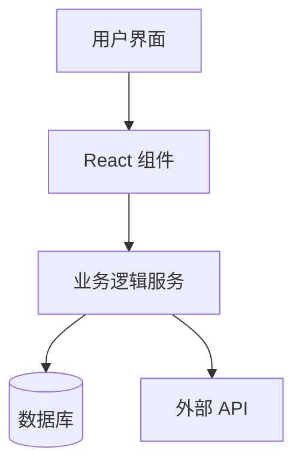
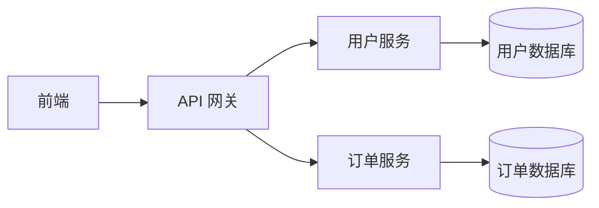

# AI 时代的代码整洁之道：面向 AI 代理的代码规范重排序

## 前言

2026 年，一个根本性的转变正在悄然发生：**代码的读者从人类程序员变成了 AI 代理**。

这个变化不是渐进的，而是颠覆性的。当我们写代码给人类阅读时，我们遵循的是 2008 年 Robert Martin 提出的 Clean Code 原则。但现在，这些原则的优先级需要被重新排序——因为 AI 代理有着与人类完全不同的约束和特点。

本文将深度解析这个转变，并给出在 AI 时代真正实用的代码整洁指南。

---

## 核心论点

### 发生了什么变化？

```
2008 年的世界：                    2026 年的世界：
─────────────────               ─────────────────
代码 → 人类阅读                  代码 → AI 代理读取
↓                               ↓
人类程序员的视角                  AI 代理的视角
• 可读性重要                     • 上下文窗口有限
• 审美偏好                      • token 成本真实存在
• 团队习惯                     • 工具调用消耗资源
• 代码审查                     • 延迟直接影响体验
```

### 核心洞察

> **"没有任何 LLM 默认做到这些。"**
> 没有明确的指示，代理会产生 2000 行的函数、没有测试、重复逻辑、2000 行的文件。

这是一个令人震惊的发现：即使是最先进的 AI 模型，也不会默认生成干净的代码。**干净的代码从来不是时尚——它变成了基础设施**。

---

## AI 代理的关键约束

理解 AI 代理的约束是掌握 AI 时代代码规范的第一步：

```
┌─────────────────────────────────────────────────────────────────┐
│                    AI 代理的关键约束                              │
├─────────────────────────────────────────────────────────────────┤
│                                                                  │
│  📏 文件截断 (File Truncation)                                  │
│  ├── 大多数代理 CLI 将读取限制在 ~2000 行/块                     │
│  └── 超过这个限制？文件被截断，上下文丢失                          │
│                                                                  │
│  🧠 注意力衰减 (Attention Degradation)                          │
│  ├── 在声称的限制之前，质量就已经下降                              │
│  └── 接近上下文限制时，代理开始遗忘重要细节                        │
│                                                                  │
│  🔍 Grep 比 Read 便宜 (Grep is Cheaper Than Read)               │
│  ├── 词法搜索 + 智能读取 > 向量检索                             │
│  └── 代理需要知道"在哪里找"，而不是"语义相似"                   │
│                                                                  │
│  💰 工具调用消耗 token (Tool Calls Cost Tokens)                 │
│  ├── 每次 Read/Edit/Bash 都消耗资源                             │
│  └── 聪明的代理最小化工具调用次数                                 │
│                                                                  │
│  ⏱️ 延迟影响体验 (Latency Matters)                              │
│  ├── 大文件拖慢整个会话                                          │
│  └── 代理需要快速响应用户                                         │
│                                                                  │
└─────────────────────────────────────────────────────────────────┘
```

### 为什么这些约束如此重要？

```
案例研究：处理一个大文件 vs 多个小文件

大文件 (2000 行)：
  代理读取 → 被截断 → 需要再次读取 → 需要记住之前的内容
  → 消耗更多 token
  → 可能丢失重要上下文
  → 编辑时更容易出错

多个小文件 (每个 200 行)：
  代理读取 → 完整理解 → 编辑 → 完成
  → 消耗更少 token
  → 上下文完整
  → 编辑更精确
```

---

## 重新排序的 13 条原则

这是 2026 年版本的 Clean Code 原则，按对 AI 代理的重要程度重新排序：

### 最高优先级 ⭐⭐⭐

#### 1. 小函数和小文件 (Small Functions and Files)

**这是最重要的原则，没有之一。**

| 文件大小 | 评估 |
|---------|------|
| > 500 行 | 危险 — 可能被截断 |
| 200-300 行 | 理想 — 一次工具调用即可完整读取 |
| < 100 行 | 最佳 — 可以快速扫描 |

```
为什么？

代理的工具调用限制：
  Read 操作 ──→ ~2000 行限制 ──→ 截断
                                    │
                                    ▼
                              上下文丢失！

解决方案：
  保持文件 < 500 行
  理想目标：200-300 行
  这样代理可以一次完整读取，不丢失任何上下文
```

#### 2. 单一职责原则 (Single Responsibility Principle)

> **代理可以隔离、测试和编辑而不产生副作用。**

```
传统观点：                         AI 时代观点：
─────────────────                ─────────────────
SRP 是为了可维护性                SRP 是为了可操作性

一个函数做多件事：                一个函数只做一件事：
  - 代理需要理解所有逻辑            - 代理可以单独编辑
  - 修改时可能破坏其他功能          - 测试更容易
  - 无法单独验证                  - 上下文清晰
```

**实际示例：**

```typescript
// ❌ 违反 SRP — 代理需要理解所有三个关注点
function processUserData(user: User) {
  validateUser(user);           // 验证
  saveToDatabase(user);         // 存储
  sendWelcomeEmail(user);       // 通知
  updateAnalytics(user);         // 分析
  return processResult;
}

// ✅ 符合 SRP — 每个函数只有一个关注点
function validateUser(user: User): ValidationResult {
  // 只做验证
}

function saveUser(user: User): SaveResult {
  // 只做存储
}

function notifyUser(user: User): NotificationResult {
  // 只做通知
}
```

#### 3. 有意义且独特的命名 (Meaningful, Unique Names)

> **"可搜索性"是 paramount（最重要的）。**

| 命名风格 | Grep 结果 | 代理体验 |
|---------|-----------|---------|
| `process()` | 50+ 个匹配 | 需要进一步搜索 |
| `handleClick()` | 50+ 个匹配 | 同上 |
| `processPaymentTransaction()` | 3 个匹配 | 精确定位 |
| `validateUserEmailForLogin()` | 1 个匹配 | 立即找到 |

```
命名原则：

1. 足够长以表达意图
   ❌ get()       → ✅ getUserByIdFromCache()
   ❌ process()   → ✅ processPaymentWebhook()

2. 包含操作类型
   ❌ data       → ✅ userAccountData
   ❌ info       → ✅ authenticationInfo

3. 避免通用词
   ❌ handler    → ✅ paymentHandler 或 emailNotificationHandler
   ❌ manager    → ✅ subscriptionManager 或 sessionManager

4. 保持一致性
   如果用 getUser，就不要混用 fetchUser 或 retrieveUser
```

#### 4. 带上下文和出处的注释 (Comments with Context and Provenance)

> **这一条与 2008 年的建议相反。AI 代理读取并重视解释"为什么"的注释，而不是"是什么"。**

```
2008 年的观点：                    2026 年的观点：
─────────────────                ─────────────────
注释应该尽量少                    上下文注释现在至关重要

原因：                            原因：
- 注释可能过时                    - 代理需要理解业务逻辑
- 代码应该自解释                  - "为什么这样设计"对代理很重要
- 维护注释是负担                  - 注释是代理决策的重要参考

注释类型的重要性变化：

❌ 废弃 (不再重要):
   // 这个函数做了 X

✅ 新增 (现在重要):
   // 为什么这样设计：这个算法的选择是因为...
   // 如果要修改，请先阅读 ARCHITECTURE.md
   // 来源：https://github.com/issue/123
```

**实际示例：**

```typescript
// ❌ 无用的注释 — 代理和代码都能告诉你这个
function addUser(user: User) {
  users.push(user);  // 添加用户到数组
}

// ✅ 有上下文的注释 — 解释"为什么"
function addUser(user: User) {
  // 为什么不直接用数据库？为了演示目的使用内存存储。
  // 参见 ADR-023 的架构决策记录。
  // TODO(v2): 当我们添加认证时，迁移到 PostgreSQL。
  users.push(user);
}

// ✅ 解释复杂逻辑
function calculateDiscount(items: CartItem[]): number {
  // 使用分层折扣而非线性折扣，因为这是运营团队的要求
  // (见 2024-03-15 的会议记录)
  // 分层：0-100 = 0%, 101-500 = 5%, 501+ = 10%
}
```

#### 5. 显式类型 (Explicit Types)

> **类型化代码给代理一个答案密钥。**

```
代理在遇到类型时面临的问题：

无类型代码：
  function process(data) {
    return data.value + data.amount
  }
  → 代理需要从使用处推断类型
  → 可能推断错误
  → 编辑时可能破坏类型假设

类型化代码：
  function process(data: { value: number; amount: number }): number {
    return data.value + data.amount
  }
  → 类型是明确的事实
  → 代理有"答案密钥"
  → 编辑时不会破坏类型假设
```

**TypeScript 示例：**

```typescript
// ❌ 无类型 — 代理需要猜测
function fetchData(url, options) {
  return fetch(url, options).then(r => r.json());
}

// ✅ 有类型 — 清晰明确
interface FetchOptions {
  url: string;
  method: 'GET' | 'POST' | 'PUT' | 'DELETE';
  headers?: Record<string, string>;
  body?: string;
  timeout?: number;
}

async function fetchData(options: FetchOptions): Promise<unknown> {
  const response = await fetch(options.url, {
    method: options.method,
    headers: options.headers,
    body: options.body,
  });
  return response.json();
}
```

**Python 类型提示：**

```python
# ❌ 无类型提示
def process_data(data, config):
    return data.get(config['key']) * config['multiplier']

# ✅ 有类型提示
from typing import TypedDict

class ProcessingConfig(TypedDict):
    key: str
    multiplier: float

def process_data(data: dict[str, Any], config: ProcessingConfig) -> float:
    return data.get(config['key'], 0) * config['multiplier']
```

#### 6. DRY (Don't Repeat Yourself)

> **代理更新一处副本，然后忘记其他；重复代码没有自然的合并引力。**

```
DRY 对人类和 AI 代理的不同影响：

人类程序员：
  看到重复 → 认识到问题 → 重构
  (有意识的决策)

AI 代理：
  看到重复 → 处理当前任务 → 继续
  (没有自然的重构冲动)

这意味着：
  - 如果代码重复，代理会在所有地方都更新它
  - 或者只更新一处，忘记其他
  - 无论哪种情况，都导致不一致
```

**实际示例：**

```typescript
// ❌ 重复 — 代理可能只更新一处
function calculateAreaOfCircle(radius: number): number {
  return 3.14159 * radius * radius;
}

function calculateCircumferenceOfCircle(radius: number): number {
  return 2 * 3.14159 * radius;
}

// ✅ DRY — 单一来源
const PI = 3.14159;

function calculateAreaOfCircle(radius: number): number {
  return PI * radius * radius;
}

function calculateCircumferenceOfCircle(radius: number): number {
  return 2 * PI * radius;
}
```

#### 7. 代理可以运行的测试 (Tests the Agent Can Run)

> **TDD 从哲学变成了技术义务。**

```
测试的 AI 代理视角：

无测试的代码库：
  代理修改代码
    ↓
  不知道是否破坏了什么
    ↓
  可能产生 bug
    ↓
  需要人类验证

有测试的代码库：
  代理修改代码
    ↓
  运行测试
    ↓
  立即知道结果
    ↓
  可以自信地继续

关键：测试必须能够无需人类设置即可执行
```

**测试要求：**

```
✅ 好：代理可以运行
   npm test
   cargo test
   pytest tests/

❌ 差：需要人类设置
   "按照 README.md 的步骤 1-5 配置数据库..."
   "首先设置本地 PostgreSQL..."
   "确保已安装并运行 Redis..."
```

---

### 仍然重要 ⭐⭐

#### 8. 可预测的目录结构 (Predictable Directory Structure)

> **代理可以预测路径，而无需列出目录。**

```
可预测结构：                     随机结构：
─────────────────              ─────────────────
src/                         lib/
  components/                   widgets/
  hooks/                         helpers.rs
  utils/                        mod.rs
  types/                        stuff.rs
  api/                         src/
                              components/
                              utils/
                              random-folder-name/

代理知道在哪里找：                代理需要探索：
  src/components/*.ts             ?
  src/hooks/*.ts                 ?
  src/api/*.ts                  ?
```

**推荐结构：**

```
src/
├── components/          # UI 组件
│   ├── Button/
│   │   ├── Button.tsx
│   │   ├── Button.test.tsx
│   │   └── index.ts
│   └── ...
├── hooks/             # React hooks
│   ├── useAuth.ts
│   └── ...
├── services/          # 业务逻辑
│   ├── userService.ts
│   └── paymentService.ts
├── types/             # 类型定义
│   └── index.ts
├── utils/             # 工具函数
│   └── format.ts
└── api/              # API 调用
    └── client.ts
```

#### 9. 依赖注入 (Dependency Injection)

> **更容易隔离；无需触碰逻辑即可替换真实实现为假实现。**

```typescript
// ❌ 硬编码依赖
class UserService {
  private db = new Database();
  private email = new SendGridEmail();

  async createUser(data: UserData) {
    const user = this.db.save(data);
    await this.email.sendWelcome(user.email);
    return user;
  }
}

// ✅ 依赖注入
class UserService {
  constructor(
    private db: DatabaseInterface,
    private email: EmailInterface
  ) {}

  async createUser(data: UserData) {
    const user = await this.db.save(data);
    await this.email.sendWelcome(user.email);
    return user;
  }
}

// 代理可以轻松注入 mock
const mockDb = new MockDatabase();
const mockEmail = new MockEmail();
const service = new UserService(mockDb, mockEmail);
```

#### 10. 避免深层嵌套 (Avoid Deep Nesting)

> **每个缩进级别都消耗注意力。四层嵌套比两层嵌套昂贵得多。**

```typescript
// ❌ 深层嵌套 — 代理需要跟踪多个嵌套级别
async function processOrder(orderId: string) {
  const order = await db.orders.findById(orderId);
  if (order) {
    const customer = await db.customers.findById(order.customerId);
    if (customer) {
      const items = await db.orderItems.findByOrderId(orderId);
      if (items.length > 0) {
        const total = items.reduce((sum, item) => {
          if (item.price > 0) {
            return sum + item.price;
          } else {
            return sum;
          }
        }, 0);
        // ... 更多嵌套
      }
    }
  }
}

// ✅ 早期返回 — 减少嵌套
async function processOrder(orderId: string) {
  const order = await db.orders.findById(orderId);
  if (!order) return;

  const customer = await db.customers.findById(order.customerId);
  if (!customer) return;

  const items = await db.orderItems.findByOrderId(orderId);
  if (items.length === 0) return;

  const total = items.reduce((sum, item) => {
    if (item.price <= 0) return sum;
    return sum + item.price;
  }, 0);

  // 处理总数...
}
```

#### 11. 带上下文的错误 (Errors with Context)

> **异常消息必须包含出错的值和预期的形状。**

```typescript
// ❌ 无用错误消息
if (!user) {
  throw new Error("User not found");
}

// ✅ 有上下文的错误
if (!user) {
  throw new Error(
    `User not found: userId=${userId}, ` +
    `expected User with id matching ${userId}, ` +
    `database contains ${availableUserIds.length} users: ${availableUserIds.slice(0, 5).join(', ')}...`
  );
}

// ✅ 使用自定义错误类
class UserNotFoundError extends Error {
  constructor(
    public readonly userId: string,
    public readonly availableUserIds: string[]
  ) {
    super(`User not found: ${userId}`);
    this.name = 'UserNotFoundError';
  }
}

// ✅ 结构化错误
interface StructuredError {
  type: 'UserNotFound' | 'ValidationError' | 'DatabaseError';
  message: string;
  context: Record<string, unknown>;
  timestamp: string;
}
```

---

### 较低优先级 ⭐

#### 12. 格式和样式 (Formatting and Style)

> **使用语言默认格式化工具。不要争论。**

```
✅ 使用：
  - cargo fmt (Rust)
  - gofmt (Go)
  - prettier (JavaScript/TypeScript)
  - black (Python)
  - rubocop --auto-correct (Ruby)

❌ 不要争论：
  - Tab vs 空格
  - 引号风格
  - 行长度限制
  - 等等

代理应该：
  1. 运行格式化工具
  2. 提交格式化后的代码
  3. 不要在代码审查中争论样式
```

#### 13. 显而易见的注释 (Obvious Comments)

> **仍然是坏的，但现在更糟。它们在 token 中浪费真金白银。**

```typescript
// ❌ 浪费 token 的注释
const users = []; // 创建一个空的用户数组
const count = users.length; // 获取用户数量

// ✅ 至少解释为什么
const users = [];
// 预分配避免在热路径中重新分配
const count = users.length;

// 但更好的做法是让代码自解释
// 如果需要注释解释"做什么"，考虑重命名
const users: User[] = [];  // 用类型说明这是 User 数组
const userCount: number = users.length;  // 变量名已说明意图
```

---

## AI 时代的新考虑

### 元文档文件 (Meta-documentation Files)

这些文件在每次工具调用之前被读取：

```
┌─────────────────────────────────────────────────────────┐
│                  元文档文件层次                            │
├─────────────────────────────────────────────────────────┤
│  📄 CLAUDE.md                                          │
│  ├── 项目级规则和指南                                    │
│  ├── 在每个对话开始时读取                                 │
│  └── 定义代理的行为规范                                  │
│                                                          │
│  📄 AGENTS.md                                          │
│  ├── 代理特定指南                                        │
│  ├── 特定代理的注意事项                                   │
│  └── 工作流程说明                                        │
│                                                          │
│  📄 .cursor/rules/                                      │
│  ├── Cursor IDE 的规则                                   │
│  ├── 项目级配置                                          │
│  └── 语言/框架特定规则                                   │
└─────────────────────────────────────────────────────────┘
```

**CLAUDE.md 示例：**

```markdown
# CLAUDE.md — 项目指南

## 项目概述
这是一个使用 TypeScript + React 的全栈应用。

## 代码规范

### 文件大小
- 目标：每个文件 < 300 行
- 硬限制：每个文件 < 500 行
- 超过 500 行？需要重构

### 命名约定
- 组件：`PascalCase.tsx` (如 `UserProfile.tsx`)
- 工具函数：`camelCase.ts` (如 `formatDate.ts`)
- 类型：`PascalCase.ts` (如 `UserTypes.ts`)

### 导入顺序
1. React 和框架导入
2. 第三方库
3. 内部类型
4. 内部组件
5. 内部工具函数

## 代理特定指南

### 不要做
- 不要修改超过 3 个文件而不说明
- 不要创建 > 500 行的文件
- 不要删除测试

### 总是做
- 运行 `npm test` 在提交之前
- 为新组件创建关联测试
- 更新此文件如果添加新的约定
```

### 带有架构图的 README

ASCII 或 Mermaid 图表帮助代理理解项目形态：

```markdown
## 项目结构

```
src/
├── components/     # React 组件
├── services/       # 业务逻辑服务
├── hooks/          # 自定义 React hooks
└── utils/          # 工具函数

[组件] ──使用──> [服务]
  │                 │
  │                 │
  ▼                 ▼
[Hooks] <──返回── [utils]
```

## Mermaid 图表示例


```

### 结构化 JSON 日志

> **代理可以轻松解析 JSON；散文日志需要启发式解析。**

```typescript
// ❌ 散文日志
logger.info(`Processing order ${orderId} for customer ${customerId}`);

// ✅ 结构化 JSON
logger.info({
  event: 'order_processing',
  orderId: orderId,
  customerId: customerId,
  timestamp: new Date().toISOString(),
  duration: performance.now() - startTime,
});

// ✅ 日志级别和元数据
logger.info({
  event: 'order_completed',
  orderId: orderId,
  customerId: customerId,
  status: 'success',
  items: items.length,
  total: orderTotal,
}, { tags: ['payment', 'order'] });
```

### 幂等启动脚本

> **代理必须能够独立引导。**

```bash
#!/bin/bash
# setup.sh — 幂等安装脚本

set -e

echo "🚀 开始设置..."

# 检查必要工具
command -v node >/dev/null 2>&1 || { echo "需要 Node.js"; exit 1; }
command -v npm >/dev/null 2>&1 || { echo "需要 npm"; exit 1; }

# 幂等：只安装如果需要
if [ ! -d "node_modules" ]; then
    echo "📦 安装依赖..."
    npm install
else
    echo "✅ 依赖已安装"
fi

# 幂等：只初始化如果不存在
if [ ! -f ".env" ]; then
    echo "📝 创建环境变量..."
    cp .env.example .env
else
    echo "✅ 环境变量已存在"
fi

# 总是可以重新运行
echo "✅ 设置完成"
```

---

## 详细教程：创建 AI 友好的代码库

### 步骤 1：设置项目结构

```bash
# 创建标准化项目结构
mkdir -p src/{components,hooks,services,types,utils,api}
mkdir -p tests/{unit,integration,e2e}
mkdir -p docs
mkdir -p scripts

# 设置元文档
touch CLAUDE.md
touch AGENTS.md
touch .cursor/rules/typescript.md
```

### 步骤 2：创建 CLAUDE.md

```markdown
# CLAUDE.md

## 项目概述
[你的项目描述]

## 技术栈
- 框架: [React/Node/etc]
- 语言: TypeScript 5.x
- 数据库: [PostgreSQL/MongoDB/etc]
- 部署: [Vercel/AWS/etc]

## 代码规范

### 文件大小限制
- 软限制: 300 行
- 硬限制: 500 行
- 超过硬限制必须重构

### 命名规范
[你的命名规范]

### 测试要求
- 所有新功能必须有测试
- 测试覆盖率 > 80%
- 运行 `npm test` 在提交前

## 代理特定规则

### 可以做
- 重构以改善代码清晰度
- 添加类型注解
- 创建测试
- 更新文档

### 不可以做
- 删除测试文件
- 修改 > 5 个文件而不说明
- 创建 > 500 行的文件
```

### 步骤 3：配置格式化工具

```json
// .prettierrc
{
  "semi": true,
  "singleQuote": true,
  "tabWidth": 2,
  "trailingComma": "es5",
  "printWidth": 100,
  "arrowParens": "avoid"
}
```

```json
// package.json scripts
{
  "scripts": {
    "format": "prettier --write \"src/**/*.{ts,tsx}\"",
    "format:check": "prettier --check \"src/**/*.{ts,tsx}\"",
    "lint": "eslint src --ext .ts,.tsx",
    "test": "vitest run",
    "test:watch": "vitest"
  }
}
```

### 步骤 4：设置 CI/CD

```yaml
# .github/workflows/ci.yml
name: CI

on: [push, pull_request]

jobs:
  test:
    runs-on: ubuntu-latest
    steps:
      - uses: actions/checkout@v4

      - name: Setup Node
        uses: actions/setup-node@v4
        with:
          node-version: '20'

      - name: Install
        run: npm ci

      - name: Format check
        run: npm run format:check

      - name: Lint
        run: npm run lint

      - name: Test
        run: npm test

  # 文件大小检查
  file-size:
    runs-on: ubuntu-latest
    steps:
      - uses: actions/checkout@v4

      - name: Check file sizes
        run: |
          find src -name "*.ts" -o -name "*.tsx" | while read file; do
            lines=$(wc -l < "$file")
            if [ $lines -gt 500 ]; then
              echo "❌ $file has $lines lines (max 500)"
              exit 1
            fi
          done
          echo "✅ All files within size limits"
```

### 步骤 5：创建架构文档

```markdown
# 架构文档

## 系统概述



## 目录结构

```
src/
├── components/     # UI 组件
│   └── [组件名]/
│       ├── [组件名].tsx
│       ├── [组件名].test.tsx
│       └── index.ts
├── services/       # 业务逻辑
│   ├── userService.ts
│   └── orderService.ts
├── hooks/          # React hooks
├── types/          # 类型定义
└── utils/         # 工具函数
```

## 关键设计决策

### 决策 1：为什么使用依赖注入？
[解释原因]

### 决策 2：为什么选择这个数据库？
[解释原因]
```

---

## 核心观点总结

### 观点一：Clean Code 从观点变成了技术约束

> **现在有了一个指标：token 成本、工具调用延迟、输出质量。**

在 AI 时代，代码整洁不再是"好代码"的标志，而是"能工作"的必要条件。脏代码会直接导致：
- 更高的 token 消耗
- 更慢的代理响应
- 更低的输出质量
- 更多的迭代循环

### 观点二：被淘汰的实践正在回归

> **那些正在过时的实践（XP、TDD、SOLID）成为与代理工作的技术差异化因素。**

TDD 不再只是"好的实践"，而是代理能够自信工作的必要条件。没有测试，代理不知道它是否破坏了任何东西。

### 观点三：命名变得比以前更重要

> **在 2000 行的限制下，能够精确定位的命名比以往任何时候都重要。**

```python
# 命名的影响力

"handler"   → 100 个匹配 → 代理需要选择
"process_payment_handler" → 2 个匹配 → 代理立即知道

差异：
- 时间：可能需要 10+ 次工具调用来定位
- Token：每次 Read 都是 token 消耗
- 错误：选错文件可能导致 bug
```

### 观点四：注释的优先级反转

> **解释"为什么"的注释变得至关重要，而"做什么"的注释变得多余。**

```typescript
// ❌ 现在更糟：浪费 token
const x = 5; // 赋值 5 给 x

// ✅ 现在重要：解释复杂的业务逻辑
// 折扣分层根据 2024-03-15 运营会议
// 分层：0-100 = 0%, 101-500 = 5%, 501+ = 10%
const discountRate = calculateDiscountRate(totalAmount);
```

### 观点五：CLAUDE.md 是新的 .gitignore

> **每个 AI 时代的项目都需要一个 CLAUDE.md 文件。**

就像 .gitignore 定义了版本控制的规则一样，CLAUDE.md 定义了与 AI 代理工作的规则。没有它，每个代理都会用自己的方式工作——通常不是你想看到的方式。

---

## 设计哲学总结

### 哲学一：AI 友好的代码首先是工具友好的代码

```
传统观点：                    AI 时代观点：
代码是给人读的              代码是给工具读的

但实际上：                   更准确的观点：
                            代码需要先被工具读懂
                            才能被工具正确使用

工具链：
  人类写代码
    ↓
  Linter 检查格式
    ↓
  TypeScript 检查类型        ← 需要显式类型
    ↓
  代理读取并编辑             ← 需要小文件、有意义的命名
    ↓
  测试验证                  ← 需要可执行测试
    ↓
  部署
```

### 哲学二：约束是解放

```
表面上看：
  文件大小限制 → 限制你的自由
  测试要求 → 增加工作

实际上：
  文件大小限制 → 代理更容易工作 → 你也更容易工作
  测试要求 → 代理有保障 → 你有保障

约束创造了：
  - 可预测性
  - 可维护性
  - 代理兼容性
  - 人类可读性
```

### 哲学三：可发现性是一等公民

```
在 2000 行的世界里，
能够被找到就是成功的 80%

使代码可被发现：
  - 独特的命名
  - 可预测的位置
  - 一致的模式
  - 清晰的导出结构

代理不应该需要探索你的代码库，
它应该能够直接导航到它需要的地方。
```

### 哲学四：结构化优于隐式

```
日志：                       配置：
❌ prose logs             ✅ JSON logs
❌ 隐式依赖               ✅ 显式 DI
❌ 魔法数字               ✅ 命名常量
❌ 字符串类型             ✅ 联合类型

结构化意味着：
  - 代理可以解析
  - 错误有上下文
  - 配置可验证
  - 类型安全
```

### 哲学五：幂等性是默认值

```
启动脚本：                  测试：
❌ 只能运行一次            ❌ 需要特定环境

✅ 幂等：可以多次运行      ✅ 可以随时运行

幂等性使代理能够：
  - 独立设置环境
  - 重复运行而不会破坏
  - 从错误恢复
  - 验证状态
```

---

## 行动指南

### 立即可做

```
□ 1. 检查你的代码库
   ├── 有多少文件超过 500 行？
   ├── 有多少文件超过 300 行？
   └── 有多少文件没有测试？

□ 2. 创建 CLAUDE.md
   └── 如果你还没有

□ 3. 设置文件大小检查
   └── 在 CI 中添加行数限制

□ 4. 运行格式化工具
   └── 确保所有代码已格式化

□ 5. 添加缺失的类型
   └── 为所有公共 API 添加类型
```

### 短期（1 周内）

```
□ 1. 重构 > 500 行的文件
   └── 拆分成更小的模块

□ 2. 添加缺失的测试
   └── 优先处理核心业务逻辑

□ 3. 统一命名约定
   └── 确保一致的命名模式

□ 4. 创建架构文档
   └── 添加 README 和架构图
```

### 中期（1 个月内）

```
□ 1. 实施依赖注入
   └── 使组件可测试

□ 2. 添加结构化日志
   └── 替换所有 prose 日志

□ 3. 设置自动化格式化
   └── pre-commit hooks

□ 4. 审查和更新所有注释
   └── 移除无用注释，添加上下文
```

### 长期（持续）

```
□ 1. 培养 AI 友好的代码习惯
   └── 从一开始就写小文件

□ 2. 投资测试覆盖率
   └── 测试是代理的保障网

□ 3. 维护 CLAUDE.md
   └── 随着项目发展更新规则

□ 4. 分享最佳实践
   └── 帮助团队适应 AI 时代
```

---

## 结语

Clean Code 原则在 2026 年并没有消亡——它们经历了重新排序。当代码的读者从人类变成 AI 代理时，一些原本属于"最佳实践"的原则变成了"技术要求"。

这个转变的核心洞察是：**干净的代码从来不是时尚，它变成了基础设施**。

在 AI 时代，代码整洁不再只是关于人类可读性——它是关于代理可操作性、token 效率、工具调用优化。遵循这些原则，你不仅在帮助 AI 代理——你在帮助任何阅读代码的人，包括你自己。

现在就开始审视你的代码库。检查那些超过 500 行的文件。添加缺失的测试。创建那个 CLAUDE.md。你的未来代理会感谢你。

---

## 参考资源

| 资源 | 链接 |
|------|------|
| 原文 | [Clean Code for AI Agents](https://akitaonrails.com/en/2026/04/20/clean-code-for-ai-agents/) |
| Clean Code 原著 | Robert C. Martin - Clean Code |
| TypeScript 文档 | [typescriptlang.org](https://www.typescriptlang.org/) |
| TDD | Test Driven Development: By Example |
| Prettier | [prettier.io](https://prettier.io/) |

---

*本文基于 2026 年 4 月 20 日发布的 "Clean Code for AI Agents" 整理。*
